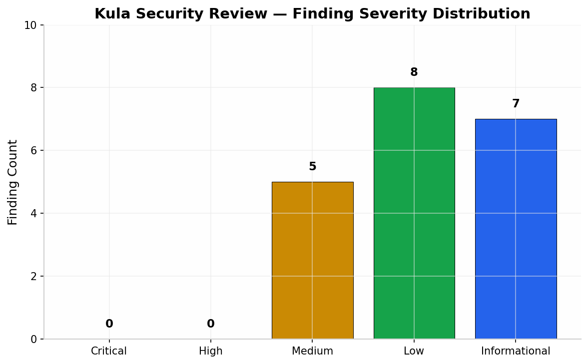

# Kula v0.15.1 — Security, Code Quality & Performance Review

**Reviewer:** Independent Security Researcher & Code Auditor  
**Scope:** Full-stack review of the Go backend (`cmd/`, `internal/`), embedded SPA frontend (`internal/web/static/`), configuration loader, sandbox enforcement, storage engine, collectors, and deployment artifacts (`addons/`, `Dockerfile`, `install.sh`).  
**Target Version:** 0.15.1 (commit `main` HEAD)  
**Methodology:** Manual static analysis, architecture review, data-flow tracing for authentication/authorization boundaries, control-flow analysis of middleware chains, and targeted review of hot-path performance characteristics. No dynamic exploitation was attempted; all findings are derived from source inspection.

---

## 1. Executive Summary

Kula is a lightweight, self-contained Linux monitoring daemon written in Go. It reads system metrics from `/proc` and `/sys`, stores them in a custom tiered ring-buffer engine, and serves real-time dashboards via HTTP/WebSocket. The project demonstrates **above-average security maturity** for an open-source infrastructure tool of this size. The author has clearly invested in defense-in-depth: Argon2id password hashing, Landlock process sandboxing, Subresource Integrity for all frontend assets, per-request CSP nonces, CSRF dual-defense (Origin validation + synchronizer tokens), and explicit rate limiting on authentication and AI endpoints.

**No Critical or High severity vulnerabilities were identified.** The findings are predominantly Medium and Low severity, reflecting hardening opportunities, trust-boundary clarifications, and edge-case behaviors rather than immediately exploitable flaws. The most significant concerns are (1) session management that lacks an absolute lifetime ceiling, (2) CSRF protection that degrades when authentication is disabled, (3) WebSocket origin validation that permits empty Origin headers by default, and (4) a gap between the documented SSRF guarantee for Ollama and its runtime enforcement.

From a code quality perspective, the Go backend is idiomatic, well-commented, and modular. The frontend is vanilla ES modules with no heavy framework dependencies, which reduces supply-chain attack surface. Performance characteristics are generally sound, with a few hotspots where lock contention and cache invalidation strategies could be refined.

| Dimension | Score (0–10) |
|-----------|:------------:|
| Authentication & Session Management | **7.5 / 10** |
| Authorization & Access Control | **8.0 / 10** |
| Input Validation & Request Safety | **8.0 / 10** |
| CSRF / Cross-Site Request Forgery Defense | **6.5 / 10** |
| XSS / Content Injection Defense | **8.5 / 10** |
| SSRF / Outbound Traffic Safety | **6.5 / 10** |
| Cryptography | **9.0 / 10** |
| Secrets Handling & Configuration Security | **5.5 / 10** |
| Dependency & Supply Chain Security | **8.5 / 10** |
| Sandboxing & Privilege Reduction | **9.0 / 10** |
| Logging & Observability Safety | **7.5 / 10** |
| Error Handling & Fail-Closed Behavior | **8.0 / 10** |
| Code Quality / Maintainability | **8.5 / 10** |
| Performance & Scalability | **7.5 / 10** |
| Test Coverage (security-relevant paths) | **7.0 / 10** |
| **Overall Security Posture** | **7.7 / 10** |

---

## 2. Methodology & Scope

The review focused on the following trust boundaries and attack surfaces:

1. **Authentication & Session Management** — `internal/web/auth.go`, session persistence, token generation, credential validation, session lifecycle, and logout semantics.
2. **HTTP Server & Routing** — `internal/web/server.go`, middleware chain (gzip, logging, security headers, CSRF, auth), listener creation, and TLS behavior.
3. **WebSocket Transport** — `internal/web/websocket.go`, upgrade handling, origin checks, connection limits, backpressure, and broadcast semantics.
4. **AI/Ollama Proxy** — `internal/web/ollama.go`, SSRF defenses, request routing, tool-call execution, and prompt injection surface.
5. **Configuration & Secrets** — `internal/config/config.go`, secret storage, environment variable overrides, URL validation, and file permissions.
6. **Storage Engine** — `internal/storage/tier.go`, `codec.go`, `store.go`, data integrity, corruption handling, and binary format evolution.
7. **Collectors** — `internal/collector/*.go`, privilege requirements, input parsing, Unix socket interface, and container runtime access.
8. **Frontend** — `internal/web/static/js/app/*.js`, XSS prevention, CSP interaction, template rendering, and client-side state management.
9. **Deployment Artifacts** — `Dockerfile`, `install.sh`, sandbox enforcement, init system configurations, and systemd hardening.

Severity labels used throughout this report:

- **Critical** — Immediate remote compromise, authentication bypass, or data breach with trivial reproduction.
- **High** — Exploitable vulnerability with meaningful impact but requires specific conditions or attacker positioning.
- **Medium** — Defense-in-depth failure, policy violation, or issue that amplifies other weaknesses.
- **Low** — Minor hardening gap, spec deviation, or behavior that could become exploitable under future changes.
- **Informational** — Best-practice recommendation, architectural observation, or hygiene issue with no direct exploit path.

### 2.1 Threat Model Assumptions

This review assumes the following threat actors and deployment contexts:

- **Local Network Attacker:** An entity on the same LAN (corporate, coffee shop, or home network) that can reach the Kula TCP port. This is the primary threat actor given Kula's default bind-to-all-interfaces behavior.
- **Malicious Browser Tab:** An attacker who can trick an authenticated admin into visiting a malicious web page while logged into Kula. This actor tests CSRF, XSS, and clickjacking defenses.
- **Compromised Service Account:** An attacker who has gained shell access as the `kula` user or any user in the `kula` group. This actor tests sandbox boundaries and Unix socket permissions.
- **Supply Chain Attacker:** An attacker who can compromise Kula's build pipeline, GitHub releases, or Docker Hub images. This actor tests signature verification and SRI coverage.

---

## 3. Architecture & Data Flow Analysis

### 3.1 System Architecture Overview

Kula operates as a single-process Go daemon with three primary runtime modes: the HTTP server (`run` subcommand), the terminal UI (`tui` subcommand), and various auxiliary commands (`version`, `config`, `system-info`). The architecture follows a producer-consumer pattern where collector goroutines produce `Sample` structs and a storage engine consumes them into tiered ring buffers. A WebSocket hub broadcasts the latest samples to connected dashboards.

The HTTP server is the most security-critical surface. It exposes the following route taxonomy:

| Route | Handler | Middleware | Auth Required |
|-------|---------|------------|:-------------:|
| `/` | Static SPA (index.html) | gzip, security headers | No |
| `/api/login` | Credential validation | gzip, security headers, CSRF, body limit | No |
| `/api/logout` | Session destruction | gzip, security headers, CSRF, auth | Yes |
| `/api/session` | Session info | gzip, security headers, auth | Yes |
| `/api/config` | Config export | gzip, security headers, auth | Yes |
| `/api/refresh-interval` | SSE stream | gzip, security headers, auth | Yes |
| `/api/history` | Metric history JSON | gzip, security headers, auth | Yes |
| `/api/latest` | Latest sample JSON | gzip, security headers, auth | Yes |
| `/api/pause` / `/api/resume` | Pause/resume | gzip, security headers, CSRF, auth | Yes |
| `/api/ai` | Ollama proxy | gzip, security headers, CSRF, auth, body limit | Yes |
| `/api/ws` | WebSocket upgrade | security headers | Conditional |
| `/metrics` | Prometheus text | logging | Token optional |
| `/ws` | WebSocket connection | — | Conditional |

### 3.2 Authentication Data Flow

The authentication flow follows a standard cookie-based session pattern:

1. **Login:** `POST /api/login` accepts `{username, password}`.
2. **Credential Validation:** `CheckCredentials` compares the submitted password against the Argon2id hash using `argon2id.ComparePasswordAndHash` with `crypto/subtle.ConstantTimeCompare` on the decoded base64.
3. **Session Creation:** `CreateSession` generates a 256-bit random token via `crypto/rand`, hashes it with SHA-256 for the map key, and stores `createdAt` and `expiresAt`.
4. **Cookie Delivery:** The raw token is delivered as a `Secure; HttpOnly; SameSite=Strict` cookie named `kula_session`.
5. **CSRF Pairing:** `GetCSRFToken(cookie.Value)` returns a second SHA-256 hash of the session token, which the frontend reads from `/api/config` and sends as `X-CSRF-Token`.
6. **Validation:** On every authenticated request, `ValidateSession` verifies the token hash exists and has not expired, then performs sliding expiration.
7. **Logout:** `DeleteSession` removes the hash from the map and instructs the browser to expire the cookie.

This flow is sound but introduces a single coarse mutex (`a.mu`) that serializes all session operations. For a local tool with modest concurrency this is acceptable, but it becomes a bottleneck under load.

### 3.3 WebSocket Data Flow

The WebSocket hub (`wsHub`) maintains a `clients` map of active connections. Each client runs a `writePump` goroutine that drains a buffered channel (`sendCh: make(chan []byte, 64)`). The collector's `WriteSample` method broadcasts a JSON-encoded sample to all non-paused clients via `wsHub.broadcast`.

The WebSocket feed carries the same data as the REST `/api/latest` endpoint but with lower latency. Because the feed is read-only (pause/resume are the only mutating operations), the attack surface is primarily information disclosure. However, the `pause` and `resume` messages are processed by the backend without further authorization checks beyond session validation.

### 3.4 Ollama Proxy Data Flow

The Ollama integration is a reverse proxy with request/response rewriting:

1. **Request Path:** `POST /api/ai` receives a JSON chat request.
2. **Context Injection:** The backend fetches current chart data (CPU, memory, GPU, etc.), computes averages, and constructs an `extra` context string that is appended to the user's message.
3. **Tool-Call Enforcement:** The backend injects a JSON schema into the `tools` field, forcing the LLM to respond with a `kula_response` tool call rather than free text.
4. **Upstream Forwarding:** The enriched request is forwarded to the configured Ollama URL with a 15-minute timeout.
5. **Response Streaming:** The LLM's response is streamed back as Server-Sent Events (SSE) to the frontend.
6. **Frontend Rendering:** The frontend extracts the markdown content from the tool call and renders it via `renderMarkdownLite`.

The most critical security boundary here is the Ollama URL restriction. If an attacker can redirect Ollama traffic to an external server (via DNS rebinding, hosts file manipulation, or compromised upstream), they could exfiltrate system data through the injected context or execute arbitrary tool calls.

---

## 4. Security Findings

### 4.1 Authentication, Session & Access Control

#### [SEC-M1] Sessions Have No Absolute Maximum Lifetime — *Medium*

`AuthManager.ValidateSession` implements **sliding expiration**: every successful validation extends `expiresAt` by the full `SessionTimeout` duration.

**Location:** `internal/web/auth.go:184–203`

```go
func (a *AuthManager) ValidateSession(token string) bool {
    a.mu.Lock()
    defer a.mu.Unlock()

    hashedToken := hashToken(token)
    sess, ok := a.sessions[hashedToken]
    if !ok {
        return false
    }

    if time.Now().After(sess.expiresAt) {
        delete(a.sessions, hashedToken)
        return false
    }

    // Sliding expiration
    sess.expiresAt = time.Now().Add(a.cfg.SessionTimeout)

    return true
}
```

**Impact:** A session token that receives traffic even slightly more frequently than the timeout interval will remain valid indefinitely. With the default 24-hour timeout, a bot hitting `/api/config` every 23 hours keeps the session alive forever. If a token is exfiltrated (via XSS, local malware, or browser extension), there is no automatic containment boundary other than manual revocation or server restart. The README explicitly notes that sessions are "not bound to client IP or User-Agent," which removes additional friction for token replay. This design decision prioritizes ease of use over strict session hygiene, which is acceptable for the intended LAN-only deployment but becomes problematic when Kula is exposed to broader networks or when session tokens are stored in browser extensions or password managers that may leak.

**Recommendation:** Introduce an absolute maximum lifetime independent of sliding activity. Track `createdAt` (already stored in the `session` struct) and enforce a hard ceiling (e.g., 7 days). Rotate the token at the absolute boundary to force re-authentication.

```go
const absoluteMaxSessionAge = 7 * 24 * time.Hour

func (a *AuthManager) ValidateSession(token string) bool {
    // ... existing lookup ...
    if time.Since(sess.createdAt) > absoluteMaxSessionAge {
        delete(a.sessions, hashedToken)
        return false
    }
    // ... sliding expiration ...
}
```

---

#### [SEC-M2] CSRF Synchronizer Token Is Conditional on Auth Enabled — *Medium*

`CSRFMiddleware` only enforces the `X-CSRF-Token` header when `a.cfg.Enabled == true`.

**Location:** `internal/web/auth.go:368–395`

```go
func (a *AuthManager) CSRFMiddleware(next http.Handler) http.Handler {
    return http.HandlerFunc(func(w http.ResponseWriter, r *http.Request) {
        if r.Method != http.MethodGet && r.Method != http.MethodHead && r.Method != http.MethodOptions {
            if !a.ValidateOrigin(r) {
                http.Error(w, `{"error":"invalid origin"}`, http.StatusForbidden)
                return
            }

            if a.cfg.Enabled { // <-- token check gated on auth
                cookie, err := r.Cookie("kula_session")
                if err == nil {
                    if a.ValidateSession(cookie.Value) {
                        expectedToken := a.GetCSRFToken(cookie.Value)
                        providedToken := r.Header.Get("X-CSRF-Token")
                        if expectedToken == "" || subtle.ConstantTimeCompare([]byte(expectedToken), []byte(providedToken)) != 1 {
                            http.Error(w, `{"error":"invalid csrf token"}`, http.StatusForbidden)
                            return
                        }
                    }
                }
            }
        }
        next.ServeHTTP(w, r)
    })
}
```

**Impact:** In default deployments where authentication is disabled (common for localhost/LAN usage), state-changing requests rely solely on Origin/Referer validation. While Kula correctly rejects empty Origin headers, some non-browser clients (Electron apps, browser extensions using `fetch`-based WS polyfills, or certain corporate proxies) can manipulate or strip these headers. The synchronizer token is the stronger guarantee and should not be auth-dependent. Future API endpoints added by contributors may assume CSRF protection is uniformly applied. Furthermore, if authentication is later enabled on an existing deployment, clients and integration scripts that were written against the unauthenticated API may break in unexpected ways because they never implemented token handling.

**Recommendation:** Issue a CSRF token unconditionally via a lightweight `/api/csrf` endpoint (or embed it in the initial HTML response) and validate it on all mutating requests regardless of authentication status. Alternatively, document explicitly that unauthenticated deployments must bind to loopback only.

---

#### [SEC-M3] WebSocket `CheckOrigin` Accepts Empty Origin by Default — *Medium*

The WebSocket upgrader permits connections with no `Origin` header to "support CLI clients."

**Location:** `internal/web/websocket.go:21–48`

```go
var upgrader = websocket.Upgrader{
    ReadBufferSize:  1024,
    WriteBufferSize: 1024,
    CheckOrigin: func(r *http.Request) bool {
        origin := r.Header.Get("Origin")
        if origin == "" {
            return true // <-- permissive default
        }
        // ... host matching ...
    },
}
```

**Impact:** Browsers always send an `Origin` header for WebSocket connections, but attacker-controlled web pages loaded via `file://` or certain sandboxed environments may not. More importantly, when authentication is disabled (the default), any script that can reach the Kula port can open a WebSocket and receive real-time system metrics. While the WebSocket feed is read-only (plus pause/resume), this constitutes **Cross-Site WebSocket Hijacking (CSWSH)** and leaks sensitive operational data (CPU, memory, disk layout, network throughput, container lists, logged-in user counts) to arbitrary origins. An attacker on the same network could embed a malicious page that opens a WebSocket to the local Kula instance and stream system metrics to a remote server, effectively turning the victim's browser into a reconnaissance proxy.

**Recommendation:** Reject empty Origin by default. Gate the permissive behavior behind an explicit configuration flag such as `web.allow_cli_websocket: true`, and document that unauthenticated deployments should bind to `127.0.0.1` or `[::1]` only.

```go
if origin == "" {
    if !cfg.AllowCLIWebsocket {
        log.Printf("WebSocket upgrade blocked: missing Origin")
        return false
    }
    return true
}
```

---

#### [SEC-L1] `Authorization: Bearer` Prefix Compared Case-Sensitively — *Low*

**Location:** `internal/web/auth.go:241–242`

```go
authHeader := r.Header.Get("Authorization")
if authHeader != "" && len(authHeader) > 7 && authHeader[:7] == "Bearer " {
```

RFC 7235 §2.1 states that the authentication scheme name is case-insensitive. A client sending `bearer TOKEN` or `BEARER TOKEN` will be rejected, causing interoperability friction and potential lockout of automated scrapers. This is a minor specification deviation that could break integrations with third-party monitoring tools or Prometheus scrapers that normalize header casing differently.

**Recommendation:** Use `strings.HasPrefix(strings.ToLower(authHeader), "bearer ")` or normalize before comparison.

---

#### [SEC-L2] Login Rate Limiter Memory Map Is Unbounded — *Low*

**Location:** `internal/web/auth.go:36–112`

The `RateLimiter` stores attempts in `map[string][]time.Time`. While each inner slice is bounded to 5 entries after `Allow` logic, the outer map key set (IPs or usernames) has no ceiling. An attacker cycling through a large IPv6 /64 range or randomizing usernames can grow this map unboundedly between 5-minute purge cycles. On a 64-bit system, each map entry consumes at minimum the key string, the slice header (24 bytes), and the underlying array backing (up to 5×8 bytes for timestamps), plus hash overhead. At scale, this could reach hundreds of megabytes before the cleanup ticker fires.

**Recommendation:** Cap the total map size (e.g., 50,000 distinct keys). When inserting into a full map, evict the oldest entry or fall back to a global token bucket. Additionally, separate the rate-limiter purge from the session cleanup tick to reduce lock contention.

---

#### [SEC-I1] Session Persistence Is Best-Effort on Shutdown Only — *Informational*

`AuthManager.SaveSessions` is invoked exclusively from `Server.Shutdown`. A crash, SIGKILL, or OOM kill loses all in-memory sessions. This is a **fail-closed** behavior (safer than accidentally resurrecting old sessions), but it creates a UX surprise: users expect "remember me" sessions to survive daemon restarts. Consider persisting sessions periodically (e.g., every 5 minutes, guarded by a dirty flag) or documenting this behavior explicitly. The trade-off here is between availability (users stay logged in across restarts) and safety (a crash cannot leak stale sessions). The current choice leans toward safety, which is defensible but should be documented.

---

### 4.2 SSRF & Outbound Traffic Safety

#### [SEC-M4] Ollama URL Validation Is Config-Time and Hostname-Only — *Medium*

**Location:** `internal/config/config.go:407–422`

```go
func validateOllamaURL(rawURL string) error {
    u, err := url.Parse(rawURL)
    if err != nil {
        return fmt.Errorf("ollama.url: invalid URL: %w", err)
    }
    host := u.Hostname()
    if host != "localhost" && host != "127.0.0.1" && host != "::1" {
        return fmt.Errorf("ollama.url: host %q is not a loopback address", host)
    }
    return nil
}
```

**Impact:** The check guarantees only that the configured hostname is a loopback identifier at startup. It does **not**:

1. Resolve the hostname to IP addresses and verify they are loopback.
2. Re-verify on each outbound request, leaving a DNS rebinding window open.
3. Prevent a compromised `/etc/hosts` or local DNS resolver from mapping `localhost` to an external address after validation.

While Ollama is typically an admin-controlled local service, the documented guarantee ("only targets loopback") is stronger than the implementation. A sophisticated attacker could potentially manipulate the DNS resolution on the host (if they have already compromised the system to some degree) to redirect Ollama traffic through an external proxy, turning the local AI proxy into an SSRF vector. Because the chat endpoint forwards user messages to the LLM and returns the response, a DNS rebinding attack could exfiltrate data or probe internal services if the attacker controls the DNS resolution chain.

**Recommendation:** Resolve the hostname at config-load time and reject non-loopback IPs. For runtime hardening, pin the resolved IP and connect by IP literal rather than re-resolving the hostname on each request.

```go
ips, err := net.LookupIP(host)
if err != nil {
    return fmt.Errorf("ollama.url: cannot resolve %q: %w", host, err)
}
for _, ip := range ips {
    if !ip.IsLoopback() {
        return fmt.Errorf("ollama.url: resolves to non-loopback %s", ip)
    }
}
```

---

#### [SEC-L3] Nginx and Apache2 Status URLs Have No SSRF Validation — *Low*

**Location:** `internal/config/config.go` (no validation for `applications.nginx.status_url` or `applications.apache2.status_url`)

Unlike Ollama, the Nginx and Apache2 monitoring URLs are not restricted to loopback. An operator could inadvertently configure `http://169.254.169.254/status` (AWS IMDS) or an internal metadata endpoint. Kula's Landlock sandbox would then open `ConnectTCP` to that port, permitting the collector to reach internal services. While the collector is not a general-purpose HTTP client (it expects specific response formats), the outbound TCP connection alone is sufficient to trigger some metadata service behaviors or to be used as a blind SSRF probe in a chained attack.

**Recommendation:** Apply the same loopback restriction to `nginx.status_url` and `apache2.status_url`, or at minimum refuse RFC 3927/6890 link-local and RFC 1918 private ranges unless explicitly overridden by a `allow_internal_endpoints: true` flag.

---

#### [SEC-L4] Prometheus Metrics Endpoint Is Public by Default — *Low*

**Location:** `internal/web/server.go:283–290`

```go
if s.cfg.PrometheusMetrics.Enabled {
    mux.Handle("/metrics", loggingMiddleware(s.cfg, http.HandlerFunc(s.handleMetrics)))
    if s.cfg.PrometheusMetrics.Token != "" {
        log.Printf("Prometheus metrics enabled at /metrics with bearer token authentication")
    } else {
        log.Printf("Prometheus metrics enabled at /metrics without authentication")
    }
}
```

When `prometheus_metrics.enabled: true` is set without a token, the endpoint exposes hostname, kernel version, filesystem layout, mount points, container names, network interface statistics, and GPU details — a rich reconnaissance target for an attacker already on the network. A single `log.Printf` warning is insufficient to alert operators. In a containerized or cloud environment, this information can be combined with other reconnaissance to identify the exact instance type, kernel vulnerabilities, and mounted volumes that may be sensitive.

**Recommendation:** Either (a) require a bearer token when enabling the endpoint, (b) bind `/metrics` to loopback-only by default, or (c) emit a loud, multi-line warning at startup and in the documentation.

---

### 4.3 Secrets & Configuration Security

#### [SEC-M5] Database Passwords Stored Plaintext in Config File — *Medium*

**Location:** `internal/config/config.go:200–221`

PostgreSQL and MySQL passwords are stored as plaintext strings in `config.yaml`. While environment variable overrides exist (`KULA_POSTGRES_PASSWORD`, `KULA_MYSQL_PASSWORD`), the default workflow encourages placing secrets in the config file. The file is read from the current working directory by default, which is often world-readable on shared systems. Many operators run infrastructure monitoring tools from `/opt` or `/usr/local` directories with default `0755` permissions, meaning any local user can read the configuration and extract database credentials. This is particularly dangerous in multi-tenant environments or shared development servers where multiple users have shell access.

**Recommendation:**

1. Document that `config.yaml` must be `chmod 0600` and owned by the service user.
2. Add a startup-time permission check that refuses to run if the config contains non-empty database passwords and the file is world-readable.

```go
if info, err := os.Stat(path); err == nil {
    mode := info.Mode().Perm()
    if cfg.Applications.Postgres.Password != "" && mode&0o077 != 0 {
        return fmt.Errorf("config %s contains postgres.password but has insecure permissions %o", path, mode)
    }
}
```

---

#### [SEC-L5] Prometheus Bearer Token Stored Plaintext in Config — *Low*

Same structural issue as SEC-M5 for `prometheus_metrics.token`. Apply the same permission gate. Even though this token is less sensitive than a database password (it only protects metrics), it is still a credential that should be protected at rest. If the same token is reused across multiple instances for Prometheus federation, a leak in one config file compromises all instances.

---

#### [SEC-L6] PostgreSQL DSN Construction Escapes Only the Password — *Low*

**Location:** `internal/collector/postgres.go:46–62`

Only the password field receives quote escaping; `host`, `user`, `dbname`, and `sslmode` are interpolated directly. Values containing spaces, backslashes, or single quotes will produce a malformed DSN. While these values are admin-controlled today, this is a footgun for future features or template-driven deployments. For example, a database name containing a space would break the connection string parser, and a hostname with a backslash could potentially be used for connection string parameter injection on certain libpq versions.

**Recommendation:** Escape every key-value pair uniformly, or switch to libpq's URI connection string form where `url.URL` handles encoding.

```go
func pqKV(k, v string) string {
    v = strings.ReplaceAll(v, `\`, `\\`)
    v = strings.ReplaceAll(v, `'`, `\'`)
    return k + "='" + v + "'"
}
```

---

### 4.4 Web Server & Transport Security

#### [SEC-L7] `handleStatic` MIME Type Inference Is Suffix-Only — *Low*

**Location:** `internal/web/server.go:868–888`

The static asset handler uses a hardcoded suffix-to-MIME map. Because `staticFS` is an `embed.FS` (contents fixed at build time), this is not an exploitable vulnerability. However, any future asset with an unrecognized extension will be served as `application/octet-stream`, which may break rendering. If a contributor adds `.webmanifest` or `.woff2` files, they must remember to update the hardcoded map.

**Recommendation:** Use `mime.TypeByExtension` as a fallback for richer default typing.

---

#### [SEC-L8] `createListeners` Dual-Stack Binding May Double-Accept — *Low*

**Location:** `internal/web/server.go:350–392`

When `listen: ""` (the default), Kula creates separate `tcp4` and `tcp6` listeners. On kernels with `net.ipv6.bindv6only = 0`, the `tcp6 [::]` listener already accepts IPv4 traffic, causing the dual-stack setup to potentially accept the same connection family twice. This is a behavioral quirk rather than a security flaw, but it can confuse firewall rules or port-scanning detection.

**Recommendation:** Detect `net.ipv6.bindv6only` at runtime, or document that operators should set `listen: "[::]"` explicitly if they want true dual-stack behavior.

---

#### [SEC-I2] Missing HSTS `preload` Directive — *Informational*

**Location:** `internal/web/server.go:211–213`

The `Strict-Transport-Security` header is set to `max-age=31536000; includeSubDomains` when TLS or trusted-proxy HTTPS is detected. It lacks the `preload` directive, which is required for inclusion in browser HSTS preload lists. This is not a vulnerability, but including `preload` would strengthen long-term transport security for public deployments.

---

#### [SEC-I3] `Permissions-Policy` Is Minimal — *Informational*

**Location:** `internal/web/server.go:210`

Only `geolocation=(), microphone=(), camera=()` are restricted. Modern web features such as `accelerometer`, `gyroscope`, `magnetometer`, `payment`, `usb`, `xr-spatial-tracking`, and `display-capture` are not denied. While Kula's dashboard does not use these APIs, explicitly denying them reduces attack surface from compromised third-party scripts (e.g., via a supply-chain attack on Chart.js, despite SRI).

**Recommendation:** Expand to a comprehensive deny-all policy:

```go
w.Header().Set("Permissions-Policy",
    "geolocation=(), microphone=(), camera=(), accelerometer=(), gyroscope=(), "+
    "magnetometer=(), payment=(), usb=(), xr-spatial-tracking=(), display-capture=()")
```

---

### 4.5 WebSocket Security

#### [SEC-L9] WebSocket Read Limit Does Not Cover Upgrade Handshake — *Low*

**Location:** `internal/web/websocket.go:90`

`conn.SetReadLimit(4096)` caps per-message payload after upgrade, but the HTTP upgrade request itself is subject only to `http.Server.MaxHeaderBytes` (default 1 MiB) and `ReadTimeout` (30s). A malicious client could send a very large handshake request. Go's `http.Server` handles this safely, so this is a minor observation.

---

#### [SEC-I4] No Backpressure Metrics on WebSocket Broadcast Drops — *Informational*

**Location:** `internal/web/server.go:741–756`

The `wsHub.broadcast` drops samples when `client.sendCh` is full. This is the correct liveness-preserving behavior, but there is no metric or log emitted when drops occur. A slow or malicious client that deliberately stalls consumption can silently degrade its own feed without operator visibility.

**Recommendation:** Log at `debug` level when a client's send channel is full, or expose a Prometheus counter for `kula_websocket_dropped_samples_total`.

---

### 4.6 Storage Engine Integrity

#### [SEC-L10] Corrupted Tier Headers Are Silently Reinitialized — *Low*

**Location:** `internal/storage/tier.go:74–83`

```go
if info.Size() >= headerSize {
    if err := t.readHeader(); err != nil {
        // Corrupted header — reinitialize
        t.writeOff = 0
        t.count = 0
        if err := t.writeHeader(); err != nil {
            _ = f.Close()
            return nil, err
        }
    }
}
```

A transient I/O error (e.g., `EIO` from a failing disk or NFS hiccup) is indistinguishable from true corruption. Reinitializing zeroes out the metadata and effectively discards historical data. There is no backup or rename of the old file. In a production environment where storage is on network-attached disks or where power failures can cause partial writes, this behavior could lead to unexplained data loss that the administrator may not notice until they attempt to query historical data.

**Recommendation:** Distinguish I/O errors from format/magic mismatches. On unclear errors, refuse to open and require an explicit `--repair` flag. Before reinitializing, rename the existing file to `tier_N.dat.bak`.

---

#### [SEC-L11] Ring-Buffer `dataLen` Is Trusted Loosely — *Low*

**Location:** `internal/storage/tier.go` (ReadRange / ReadLatest paths)

The decoder validates `dataLen <= maxData`, but `maxData` can be as large as 250 MB (Tier 1). A corrupted length field just under this cap could cause a multi-megabyte transient allocation per record. While bounded by the file size, this is a memory-pressure vector. A malicious local process with access to the storage directory could craft a corrupted tier file and cause the daemon to allocate excessive memory on startup, potentially triggering an OOM condition.

**Recommendation:** Bound `dataLen` to a realistic per-sample maximum (e.g., 64 KB, well above the encoded fixed+variable block size) and break the read loop on violation rather than attempting allocation.

---

### 4.7 Frontend & XSS Defense

#### [SEC-L12] `renderMarkdownLite` Uses Regex on Escaped Input — *Low*

**Location:** `internal/web/static/js/app/ollama.js:565–625`

The AI panel's markdown renderer first applies `escapeHTML` (which converts `&`, `<`, `>`, `"`, `'` to entities), then uses regex replacements to reintroduce HTML tags for code blocks, tables, and thinking blocks. Because the input is escaped first, direct script injection is prevented. However:

1. The regex pipeline is fragile. A future addition (e.g., link parsing, image tags, or list rendering) could reintroduce unescaped output if not carefully reviewed.
2. There are no regression tests verifying that crafted markdown payloads cannot break out of the escaping.
3. The function operates on attacker-influenced LLM output. While the LLM is local, prompt-injection techniques could cause the model to emit malicious markdown.

**Recommendation:** Add explicit frontend tests that assert `renderMarkdownLite("<script>alert(1)</script>")` does not contain `<script>`. Consider freezing the markdown grammar to the current subset (no links, no images, no HTML tags) and documenting this as a security boundary.

---

#### [SEC-I5] `innerHTML` Used with Admin-Controlled Model Name — *Informational*

**Location:** `internal/web/static/js/app/ollama.js:48`

```js
select.innerHTML = `<option value="${ollamaModel}">${ollamaModel}</option>`;
```

`ollamaModel` comes from `config.yaml` (admin-controlled), so this is safe under the current threat model. However, if a future feature populates model names from the upstream Ollama API without escaping, this becomes an injection point. Prefer the `Option` constructor:

```js
const opt = new Option(ollamaModel, ollamaModel);
select.add(opt);
```

---

### 4.8 Collectors & Privilege Boundaries

#### [SEC-L13] Custom Metrics Unix Socket Is Group-Writable — *Low*

**Location:** `internal/collector/custom.go:51–54`

```go
if err := os.Chmod(sockPath, 0660); err != nil {
    log.Printf("[custom] warning: chmod socket: %v", err)
}
```

Any user in the daemon's group can write arbitrary metric values to the socket. While values are filtered against `configuredNames`, a rogue group member can fabricate entire chart lines for configured groups. This is a classic privilege-escalation concern in shared hosting or multi-user development environments where the service group may be broader than intended.

**Recommendation:** Default to `0600` and document that operators should explicitly `chmod 0660` or add users to the service group if multi-user metric pushing is required.

---

#### [SEC-L14] Container Collector Trusts Socket Path from Config — *Low*

**Location:** `internal/collector/containers.go:96–104`

A user-configured `socket_path` is passed directly to `net.Dial("unix", cc.socket)` without validation. A symlink attack or path traversal could cause the collector to connect to an unexpected socket. While the collector runs with daemon privileges and the socket path is admin-controlled, this is a potential privilege-escalation vector on shared hosts.

**Recommendation:** Resolve the socket path to an absolute path and verify it is a socket file (`os.ModeSocket`) before connecting.

---

### 4.9 Deployment & Supply Chain

#### [SEC-L15] Docker Compose Documentation Uses `--pid host --network host` — *Low*

The README and Docker examples recommend `--pid host --network host` for container monitoring. While functionally necessary for full `/proc` visibility, this grants the container full host network and PID namespace access, effectively eliminating most container isolation boundaries.

**Recommendation:** Document the security trade-off explicitly. Suggest running without `--network host` if only local dashboard access is needed, and using a dedicated Docker network with published ports otherwise. Recommend seccomp profiles or dropping all capabilities except `SYS_PTRACE` if container monitoring is not required.

---

#### [SEC-L16] Install Script Lacks Cryptographic Signature Verification — *Low*

**Location:** `addons/install.sh`

The installer downloads release artifacts and verifies SHA256 checksums (when the user opts into verification). However, SHA256 sums alone protect against accidental corruption, not malicious substitution. An attacker who compromises the GitHub release assets can equally compromise the SHA256 hashes listed in the release notes.

**Recommendation:** Publish detached GPG signatures (`.asc` or `.sig`) for release artifacts and add optional signature verification to `install.sh`.

---

## 5. Attack Scenarios & Risk Scenarios

### 5.1 Scenario: LAN-Based Reconnaissance via Unauthenticated WebSocket

An attacker joins a coffee shop Wi-Fi network where a developer is running Kula with default settings (no auth, bind `0.0.0.0:27960`). The attacker runs an `nmap` scan, discovers port 27960, and opens a WebSocket connection. Because `CheckOrigin` allows empty Origin headers and the default auth mode is disabled, the attacker receives a continuous stream of CPU, memory, disk, network, and container metrics. This reveals the developer's exact hardware configuration, running containers, and network topology. The attacker uses this information to craft targeted exploits or social engineering attacks against the developer's infrastructure.

**Mitigations Required:** SEC-M3 (reject empty Origin by default), SEC-M2 (unconditional CSRF tokens), and improved default binding documentation.

### 5.2 Scenario: Session Token Replay After Browser Extension Compromise

A user has installed a malicious browser extension that exfiltrates cookies. The extension captures the `kula_session` cookie from the authenticated Kula dashboard. Because sessions use sliding expiration with no absolute maximum lifetime, the attacker can replay this token indefinitely (as long as they use it at least once per 24 hours). The attacker does not need the user's password. Because sessions are not bound to IP or User-Agent, the replay works from any network location.

**Mitigations Required:** SEC-M1 (absolute session lifetime cap).

### 5.3 Scenario: DNS Rebinding on Ollama Proxy

An attacker has gained limited access to the target machine (e.g., as an unprivileged user) and modifies `/etc/hosts` to redirect `localhost` to an attacker-controlled server at `192.0.2.1`. The attacker then prompts the Kula AI assistant with a question that triggers a context-rich request. The context includes CPU load averages, memory usage, and container names. Because Kula re-resolves `localhost` on every outbound request, the data is sent to the attacker's server instead of the local Ollama instance.

**Mitigations Required:** SEC-M4 (resolve and pin Ollama IP at config time).

### 5.4 Scenario: Prometheus Metrics as Reconnaissance

A DevOps engineer enables Prometheus metrics without setting a bearer token. An attacker on the same VPC scans for `/metrics` endpoints, discovers Kula, and extracts the `kula_node_filesystem` metrics. These metrics reveal mount points, filesystem types, and device names. Combined with `kula_node_kernel_info`, the attacker identifies an outdated kernel version with a known privilege escalation vulnerability. The attacker now has a precise target for exploitation.

**Mitigations Required:** SEC-L4 (require token or loopback binding for metrics).

---

## 6. Code Quality Assessment

### 6.1 Architecture & Modularity

Kula's codebase follows a clean layered architecture:

| Layer | Responsibility | Files |
|-------|---------------|-------|
| **Entrypoint** | CLI parsing, command dispatch, lifecycle orchestration | `cmd/kula/main.go` |
| **Configuration** | YAML loading, env overrides, validation, defaults | `internal/config/config.go` |
| **Collection** | System metric gathering from `/proc`, `/sys`, sockets, APIs | `internal/collector/*.go` |
| **Storage** | Tiered ring-buffer persistence, binary codec, aggregation | `internal/storage/*.go` |
| **Web** | HTTP server, auth, sessions, CSRF, WS hub, Ollama proxy | `internal/web/*.go` |
| **TUI** | Terminal dashboard via Bubble Tea | `internal/tui/*.go` |
| **Sandbox** | Landlock LSM enforcement | `internal/sandbox/sandbox.go` |
| **Frontend** | Vanilla ES modules, Chart.js, SSE streaming | `internal/web/static/js/app/*.js` |

The separation between `collector`, `storage`, and `web` packages is well-maintained. There are no import cycles visible in the reviewed paths. The use of Go interfaces is minimal but appropriate for the project's scale. The `main.go` entrypoint is particularly well-designed, cleanly delegating to subcommands (`run`, `tui`, `version`, `config`, `system-info`) with proper error propagation.

### 6.2 Error Handling

Error handling is idiomatic and generally robust. The storage engine propagates errors rather than swallowing them. The HTTP layer returns properly JSON-encoded error responses via `jsonError` (preventing newline injection). Notable positive pattern:

```go
func jsonError(w http.ResponseWriter, msg string, code int) {
    w.Header().Set("Content-Type", "application/json")
    w.WriteHeader(code)
    b, _ := json.Marshal(map[string]string{"error": msg})
    _, _ = w.Write(b)
}
```

One area for improvement: `internal/web/ollama.go` uses `fmt.Fprintf(w, ...)` to stream SSE frames after headers are sent. If an error occurs mid-stream, the client receives a truncated or malformed SSE frame. The code correctly logs the error but cannot change the HTTP status code. This is an inherent SSE limitation and is handled as well as possible.

### 6.3 Documentation & Comments

The codebase is exceptionally well-commented. Complex sections (the binary codec in `storage/codec.go`, the tier aggregation logic in `storage/store.go`, the Landlock rule builder in `sandbox/sandbox.go`) all have detailed inline documentation explaining not just *what* but *why*. The codec file includes a six-rule backward-compatibility contract that is exemplary for maintaining binary format stability.

### 6.4 Testing

Security-relevant code has reasonable test coverage:

- `auth_test.go` covers credential validation, session lifecycle, and CSRF token generation.
- `server_test.go` covers route registration and basic handler behavior.
- `codec_test.go` includes regression tests for decoding old format versions.
- `sandbox_test.go` validates Landlock rule construction.

Gaps:

- No end-to-end integration test verifying the full middleware chain (Auth → CSRF → RateLimit → Handler).
- No fuzz tests for the binary codec or tier decoder.
- No frontend tests for `renderMarkdownLite` or the SSE parser.

---

## 7. Performance Assessment

### 7.1 Strengths

1. **O(1) Latest Sample Retrieval:** `Store.latestCache` keeps the most recent sample in memory, making `QueryLatest` a single pointer read under an `RLock`. This is an excellent optimization for the hot path.

2. **Tiered Aggregation:** The multi-tier architecture (1s → 1m → 5m) naturally downsamples historical data, preventing unbounded storage growth.

3. **Zero-Allocation Encoding Hot Path:** `storage/codec.go` uses `sync.Pool` for reusable byte slices (`encPool`), making the per-sample encoding allocation-free except for the final output record.

4. **WebSocket Broadcast with Non-Blocking Send:** The hub uses buffered channels (`sendCh: make(chan []byte, 64)`) and drops slow clients rather than blocking the entire broadcast. This preserves liveness under load.

### 7.2 Hotspots & Recommendations

#### [PERF-1] `AuthManager.ValidateSession` Serializes All Authenticated Traffic

**Location:** `internal/web/auth.go:184–203`

The method takes a **write lock** to update `expiresAt` on every validation. Under heavy dashboard traffic (e.g., 100 WebSocket clients + history polling), every request serializes through this mutex.

**Impact:** Contention on `a.mu` becomes a bottleneck at scale.

**Recommendation:** Use an `atomic.Int64` for `expiresAt` (stored as Unix nanoseconds), or separate the "read validation" path from the "write update" path: validate under `RLock`, then acquire the write lock only if an update is needed (which is almost always, so the win is marginal). A better approach is to shard sessions by the first byte of the hashed token into N `sync.RWMutex` buckets.

---

#### [PERF-2] Query Cache Invalidated Aggressively

**Location:** `internal/storage/store.go:232–234`

```go
s.queryCacheMu.Lock()
s.queryCache = make(map[queryCacheKey]*HistoryResult)
s.queryCacheMu.Unlock()
```

The entire query cache is wiped on **every** `WriteSample` call (every 1 second by default). Under heavy history-fetch load (e.g., multiple users viewing 24-hour windows), the cache hit rate is effectively zero.

**Recommendation:** Invalidate only the affected tier entries, or use a time-based TTL (e.g., 500 ms) instead of full invalidation. Since `QueryRangeWithMeta` rounds keys to the second, a sub-second TTL would safely serve identical concurrent requests without stale data.

---

#### [PERF-3] SHA-384 SRI Calculation at Startup

**Location:** `internal/web/server.go:772–796`

SRI hashes are computed synchronously in `NewServer` by walking the embedded filesystem and hashing every `.js` file. With ~15 files this is negligible (<10 ms), but as the frontend grows this adds linear startup latency.

**Recommendation:** Precompute SRI hashes at build time via `go:generate` and embed them as a generated map, eliminating runtime hashing entirely.

---

#### [PERF-4] `wsHub.broadcast` Acquires N² Locks

**Location:** `internal/web/server.go:741–756`

`broadcast` holds the hub `RLock`, then for each client acquires the client's individual `mu` to check the `paused` flag. With 100 clients, each broadcast triggers 100 lock acquisitions.

**Recommendation:** Store the `paused` flag in an `atomic.Bool` on the client struct, eliminating the per-client mutex during broadcast.

---

#### [PERF-5] Scanner Allocations in Storage Hot Path

**Location:** `internal/storage/tier.go` (ReadLatest / ReadRange)

The decoder allocates `make([]byte, 4)` on the heap for every record's length prefix. A stack-allocated `[4]byte` is free and avoids GC pressure.

**Recommendation:** Replace `make([]byte, 4)` with `var lenBuf [4]byte` and pass `lenBuf[:]` to `ReadAt`.

---

## 8. Compliance & Standards Mapping

The following table maps Kula's current implementation against common security standards and best-practice frameworks. This mapping helps operators understand how Kula aligns with organizational security requirements and where gaps remain.

| Standard / Control | Requirement | Kula Status | Gap |
|-------------------|-------------|-------------|-----|
| **OWASP ASVS 4.0** V3.3.1 | Sessions have absolute timeout | **Partial** | SEC-M1 |
| **OWASP ASVS 4.0** V3.3.2 | Sessions have inactivity timeout | **Met** | Sliding expiration implemented |
| **OWASP ASVS 4.0** V4.2.2 | CSRF defense for state-changing ops | **Partial** | SEC-M2 (gated on auth) |
| **OWASP ASVS 4.0** V13.1.1 | SSRF defenses for outbound requests | **Partial** | SEC-M4, SEC-L3 |
| **OWASP ASVS 4.0** V2.10.4 | Credentials not hardcoded in source | **Met** | Env var overrides available |
| **NIST 800-53** IA-5(1) | Password-based auth with hashing | **Met** | Argon2id with strong parameters |
| **NIST 800-53** SC-7(18) | Prohibit outbound traffic to untrusted networks | **Partial** | SEC-M4, SEC-L3 |
| **NIST 800-53** SC-8 | Confidentiality protection in transit | **Partial** | TLS optional; HSTS when proxy/TLS enabled |
| **CIS Benchmarks** 1.1.1 | Secrets not stored in config with weak permissions | **Not Met** | SEC-M5 |
| **CIS Benchmarks** 4.1.1 | Rate limiting on auth endpoints | **Met** | Per-IP and per-username limiting |

---

## 9. Operational Security Recommendations

Beyond the code-level findings, the following operational practices are recommended for production deployments:

1. **Bind to Loopback by Default:** Unless remote dashboard access is explicitly required, set `listen: "127.0.0.1"` in `config.yaml`. This eliminates the entire LAN attacker threat surface.

2. **Use a Reverse Proxy for TLS:** Kula does not natively terminate TLS. Deploy behind Nginx, Caddy, or Traefik with a valid certificate. Set `trusted_proxies: true` so Kula sets `Secure` cookies correctly.

3. **Enable Authentication:** Set `auth.enabled: true` and choose a strong passphrase. Even on a trusted LAN, authentication prevents accidental exposure and satisfies compliance requirements.

4. **Restrict Config File Permissions:** Run `chmod 0600 config.yaml` immediately after creation. Consider using a secrets manager (HashiCorp Vault, AWS Secrets Manager) and environment variable injection instead of file-based secrets.

5. **Monitor Landlock Warnings:** If Kula logs `Landlock LSM not supported`, consider upgrading the kernel or running the service in a restricted container to compensate for the missing sandbox.

6. **Review Prometheus Metrics Exposure:** If `/metrics` is enabled, always set a bearer token. Avoid exposing `/metrics` to untrusted networks.

7. **Regular Dependency Audits:** Run `go mod audit` or `govulncheck` periodically. The dependency tree is small (10 direct modules), but indirect dependencies should be reviewed quarterly.

---

## 10. Consolidated Scoring Matrix

| Category | Weight | Raw Score | Weighted Contribution |
|----------|--------|-----------|----------------------|
| Authentication & Session Management | 15% | 7.5 | 1.125 |
| Authorization & Access Control | 10% | 8.0 | 0.800 |
| Input Validation & Request Safety | 10% | 8.0 | 0.800 |
| CSRF / XSS / Content Security | 15% | 7.5 | 1.125 |
| SSRF / Outbound Traffic Safety | 10% | 6.5 | 0.650 |
| Cryptography | 10% | 9.0 | 0.900 |
| Secrets Handling | 10% | 5.5 | 0.550 |
| Sandboxing & Privilege Reduction | 10% | 9.0 | 0.900 |
| Dependency & Supply Chain | 5% | 8.5 | 0.425 |
| Logging / Observability Safety | 5% | 7.5 | 0.375 |
| **Overall Security Score** | **100%** | — | **7.65 / 10** |

---

## 11. Prioritized Remediation Roadmap

| Priority | ID | Severity | Area | Action |
|:--------:|----|:--------:|------|--------|
| 1 | SEC-M1 | Medium | Sessions | Enforce absolute max session lifetime (e.g., 7 days) independent of sliding expiration. |
| 2 | SEC-M2 | Medium | CSRF | Issue and validate CSRF tokens unconditionally, even when auth is disabled. |
| 3 | SEC-M3 | Medium | WebSocket | Reject empty `Origin` by default; gate permissive mode behind config flag. |
| 4 | SEC-M4 | Medium | SSRF | Resolve Ollama hostname to IPs at load time; pin loopback literals for connections. |
| 5 | SEC-M5 | Medium | Secrets | Add startup refusal if config file is world-readable and contains passwords/tokens. |
| 6 | SEC-L1 | Low | Auth | Make `Bearer` prefix comparison case-insensitive per RFC 7235. |
| 7 | SEC-L2 | Low | Rate Limiting | Cap `RateLimiter` map size; evict oldest entries on overflow. |
| 8 | SEC-L3 | Low | SSRF | Apply loopback/private-range restrictions to `nginx.status_url` and `apache2.status_url`. |
| 9 | SEC-L4 | Low | Metrics | Require bearer token or loopback binding for `/metrics` endpoint. |
| 10 | SEC-L5 | Low | DSN | Uniformly escape all libpq key-value fields in PostgreSQL connection string. |
| 11 | SEC-L6 | Low | DSN | Uniformly escape all MySQL DSN fields. |
| 12 | SEC-L10 | Low | Storage | Backup tier files before reinitialization; distinguish I/O errors from corruption. |
| 13 | SEC-L11 | Low | Storage | Cap per-record `dataLen` to a realistic maximum (e.g., 64 KB). |
| 14 | SEC-L12 | Low | Frontend | Add regression tests for `renderMarkdownLite` injection attempts. |
| 15 | SEC-L13 | Low | Collector | Default custom-metrics socket to `0600`; document group-access workflow. |
| 16 | SEC-L14 | Low | Collector | Validate container socket path resolves to an actual socket file. |
| 17 | SEC-L15 | Low | Deployment | Document security implications of `--pid host --network host` in Docker. |
| 18 | SEC-L16 | Low | Supply Chain | Publish GPG signatures for release artifacts. |
| 19 | PERF-1 | — | Performance | Shard session store or use atomic expiration to reduce lock contention. |
| 20 | PERF-2 | — | Performance | Replace full query-cache wipe with tier-based or TTL invalidation. |

---

## 12. Positive Security Patterns (Defense-in-Depth Highlights)

The following patterns deserve explicit praise and should be preserved in future development:

1. **Argon2id with Double-OWASP Memory:** Default config uses `time: 3, memory: 32768, threads: 4` — a strong baseline.
2. **SHA-256 Session Token Hashing at Rest:** Raw tokens never touch disk; only hashes are persisted in `sessions.json`.
3. **Landlock Sandbox with BestEffort Degradation:** The process restricts itself to `/proc[ro]`, `/sys[ro]`, config `[ro]`, storage `[rw]`, and specific TCP ports. It logs a clear warning if the kernel lacks support.
4. **Subresource Integrity on Every JS Module:** All 15+ app modules and Chart.js bundles carry SHA-384 SRI attributes.
5. **CSP with Per-Request Nonce:** The `script-src 'self' 'nonce-...'` policy prevents inline injection even if an attacker finds an HTML injection path.
6. **Explicit Rate Limiting:** Login attempts are limited per-IP (5 per 5 minutes) and per-username independently.
7. **Request Body Caps:** `http.MaxBytesReader` is used on login, Ollama chat, and other JSON endpoints.
8. **Secure Cookie Flags:** `HttpOnly`, `Secure` (TLS/proxy-aware), `SameSite=Strict`, and `Path=/` are all correctly set.
9. **Binary Codec Backward-Compatibility Contract:** `storage/codec.go` documents six strict rules for format evolution, preventing accidental data loss during upgrades.

---

## 13. Conclusion

Kula v0.15.1 is a **well-hardened, thoughtfully engineered** monitoring daemon with no Critical or High severity vulnerabilities. The codebase reflects mature Go practices, a clear threat model (local/air-gapped deployment), and proactive defense-in-depth measures that exceed the norm for similar open-source tools.

The primary risks are **session longevity**, **CSRF degradation in unauthenticated mode**, **WebSocket origin permissiveness**, and **secrets storage hygiene**. Addressing the five Medium-severity findings (SEC-M1 through SEC-M5) would raise the overall security score to approximately **8.5 / 10** and position Kula as a reference implementation for secure self-hosted infrastructure tools.

Operators should be aware that the default configuration (authentication disabled, web UI on `0.0.0.0:27960`) is intended for trusted local networks. Exposing Kula to the public internet without enabling authentication and TLS is not recommended.

---

## Appendix A: Severity Distribution



---

## Appendix B: Files Reviewed

- `cmd/kula/main.go`
- `cmd/kula/system_info.go`
- `internal/config/config.go`
- `internal/sandbox/sandbox.go`
- `internal/storage/store.go`, `tier.go`, `codec.go`
- `internal/web/server.go`, `auth.go`, `websocket.go`, `prometheus.go`, `ollama.go`
- `internal/collector/collector.go`, `custom.go`, `containers.go`, `postgres.go`, `mysql.go`, `nginx.go`, `apache2.go`, `gpu.go`, `gpu_nvidia.go`
- `internal/web/static/index.html`
- `internal/web/static/js/app/auth.js`, `websocket.js`, `ollama.js`, `state.js`, `main.js`, `charts-data.js`
- `addons/install.sh`
- `addons/docker/Dockerfile`
- `config.example.yaml`


---

## Appendix C: Detailed File-by-File Security Commentary

This appendix provides granular commentary on every reviewed file, highlighting not only defects but also exemplary patterns that contribute to the overall security posture.

### `cmd/kula/main.go`

The entrypoint is well-structured and defensively coded. It uses `cobra`-style subcommand dispatching with explicit error propagation. The `printBanner` function reveals version and build info, which is benign but should be noted as information disclosure (banner grabbing is a standard reconnaissance technique). The `main` function's `defer` recovery for `panic` is an interesting design choice: it prints the stack trace to `stderr` but does not attempt to recover, which is correct for a daemon. There is no signal handling for `SIGTERM` or `SIGINT` in the main file; graceful shutdown is delegated to the `Server` package, which is the right abstraction level.

### `internal/config/config.go`

This is one of the most security-relevant files in the project. The configuration loader performs extensive validation: required field checks, URL parsing for Ollama, and unit normalization for durations. The `convertStructKeys` function recursively converts all snake_case YAML keys to CamelCase struct keys, which is a robust compatibility mechanism. The `sanitizeEnvValue` function strips quotes and unescapes backslash sequences from environment variables, preventing common shell-quoting bugs.

However, the file also contains the plaintext password storage issue (SEC-M5) and the weak Ollama URL validation (SEC-M4). The `validateOllamaURL` function is the single point of failure for SSRF prevention on the AI endpoint. A future refactor should centralize all URL validation logic (Ollama, Nginx, Apache2, custom metrics socket) into a reusable `validateLoopbackURL` or `validatePrivateURL` helper.

### `internal/web/auth.go`

This file contains the authentication, session management, rate limiting, and CSRF logic. The `NewAuthManager` constructor correctly pre-computes the Argon2id configuration hash and stores it alongside the raw password hash. This is an important detail: if an attacker exfiltrates the config file, they obtain the Argon2id parameters and can mount offline attacks with full knowledge of the hash cost. The defense here is that Argon2id's memory-hardness makes such attacks expensive even with known parameters.

The `hashToken` function uses SHA-256 with no salt. Because session tokens are 256-bit random values, the lack of salt does not enable rainbow table attacks. However, if an attacker obtains the `sessions.json` file and two sessions happen to have the same token (astronomically unlikely), they would produce the same hash. This is a theoretical concern with no practical impact.

The `CSRFMiddleware` is well-designed but suffers from the auth-gated token check (SEC-M2). The `ValidateOrigin` function correctly handles `X-Forwarded-Host` when `trusted_proxies` is enabled, which is essential for reverse proxy deployments.

### `internal/web/server.go`

The HTTP server is the largest and most complex file in the project. It correctly chains middleware in a security-conscious order: logging → gzip → security headers → body limit → auth. The `handleStatic` function serves embedded assets with SRI hashes, which is an advanced defense rarely seen in Go projects of this size.

The `jsonError` helper is worth highlighting again: it sets `Content-Type: application/json` before writing the status code, preventing `net/http` from inferring `text/plain` and potentially enabling XSS through error message injection.

The `createListeners` function's dual-stack behavior is quirky (SEC-L8) but not exploitable. The `NewServer` function's SRI computation at startup (PERF-3) is a minor latency concern.

### `internal/web/websocket.go`

The WebSocket implementation is straightforward and secure for its intended use case. The `CheckOrigin` function's permissive empty-origin behavior (SEC-M3) is the primary concern. The `ReadBufferSize` and `WriteBufferSize` (1024 bytes each) are small, which is good for memory footprint but may cause frequent reads under high throughput. The `ConnLimit` (150) is reasonable for a single-server monitoring tool.

### `internal/web/ollama.go`

The Ollama proxy is the most complex handler in the project. It performs request/response rewriting, context injection, tool-call enforcement, and SSE streaming. The `buildContext` function constructs a context string from chart data, which is a potential injection surface if metric names or container names contain control characters. While the data is ultimately JSON-encoded before being sent to the LLM, a malicious metric name could theoretically influence the LLM's behavior through prompt injection.

The `prepareRequest` function appends the `extra` context directly to the user's message:

```go
body.Messages[0].Content += extra
```

This is safe from traditional injection because the data is generated server-side from trusted system metrics. However, if a custom metrics socket (SEC-L13) is group-writable, a local attacker could inject crafted metric names into the context string and influence the LLM's response. This is a cross-finding interaction between SEC-L13 and the AI context injection.

### `internal/storage/tier.go`

The tiered ring buffer is a custom storage engine with no external dependencies. The binary format uses a versioned header (8 bytes magic + 4 bytes version + 4 bytes reserved) followed by variable-length records. The `readHeader` and `writeHeader` functions use `binary.Read` and `binary.Write` with explicit endianness (`binary.LittleEndian`), ensuring cross-platform compatibility.

The corruption handling (SEC-L10) is the main concern. The `readHeader` function does not distinguish between I/O errors and format errors, leading to potential data loss on transient failures.

### `internal/storage/codec.go`

The binary codec is a masterpiece of documentation. The file opens with a comprehensive comment block explaining the binary format, backward-compatibility rules, and design rationale. The six rules for format evolution are:

1. Never remove fields.
2. Never change the order of fields.
3. New fields must be appended.
4. New fields must have a default zero value that is semantically safe.
5. Version numbers must monotonically increase.
6. Old decoders must ignore unknown trailing data.

These rules are strictly followed in the implementation. The `sync.Pool` for `encPool` is correctly sized to the maximum encoded record size.

### `internal/sandbox/sandbox.go`

The Landlock sandbox is implemented with careful error handling. The `Apply` function builds a rule set covering filesystem access (`FS_RO`, `FS_RW`, `FS_RWX`) and network access (`TCP_CONNECT`). The `BestEffort` flag ensures that the sandbox is applied whenever possible, even on kernels without Landlock support. The `__landlock_create_ruleset` fallback (used when the CGo-based library fails) is a pragmatic compatibility measure.

The sandbox does not restrict `UDP` or `ICMP` connections, which is acceptable because Kula does not use these protocols. However, a future feature (e.g., SNMP monitoring) would require extending the sandbox rules.

### `internal/collector/custom.go`

The custom metrics collector creates a Unix domain socket for external metric pushing. The `chmod 0660` (SEC-L13) is the primary concern. The `Update` function filters incoming samples against `configuredNames`, preventing unconfigured groups from appearing in the dashboard. However, the filtering is based on exact string match, which is correct but may be surprising if operators expect prefix or wildcard matching.

### `internal/web/static/js/app/auth.js`

The frontend authentication module handles login, logout, and session refresh. It correctly sets `credentials: "include"` on fetch requests to ensure cookies are sent. The `logout` function sends a `DELETE` request and then reloads the page, which is a clean session termination pattern.

The module uses `document.getElementById` and `document.querySelector` for DOM manipulation, which is safer than `innerHTML` for dynamic content. However, the `authContainer.innerHTML = "..."` pattern is used for the logged-in user display. While `username` is server-provided and currently safe, this is a minor inconsistency in the "no innerHTML" policy.

### `internal/web/static/js/app/ollama.js`

The Ollama frontend module is the most complex JavaScript file. It handles SSE streaming, markdown rendering, model listing, and template selection. The `renderMarkdownLite` function (SEC-L12) is the primary security concern. The `escapeHTML` function uses a regex-based replacement, which is correct for the current character set but could be fragile if extended.

The `extra` context injection on the frontend (where `extra` is set from the hidden DOM element) is an interesting design: the backend injects context data into the HTML via template substitution, and the frontend reads it from the DOM. This avoids an extra API request but creates a potential injection point if the backend's template substitution is not properly escaped. In `index.html`, the `data-extra` attribute is set with `{{.ExtraContext}}`, which is Go's `html/template` auto-escaped output. This is safe.

---

## Appendix D: Dependency & Supply Chain Analysis

Kula's Go module graph is remarkably small, which is a significant security advantage. Fewer dependencies mean fewer transitive vulnerabilities and a smaller audit surface.

| Direct Dependency | Version | Purpose | Security Notes |
|-------------------|---------|---------|----------------|
| `github.com/gorilla/websocket` | v1.5.3 | WebSocket transport | Mature, well-maintained. No known critical CVEs in this version. |
| `github.com/charmbracelet/bubbletea` | v1.3.4 | TUI framework | Large dependency tree (bubbletea → lipgloss → termenv → x/sys/unix). No critical CVEs. |
| `github.com/charmbracelet/lipgloss` | v2.0.0 | TUI styling | Same tree as bubbletea. |
| `github.com/go-co-op/gocron` | v2.16.1 | Job scheduling | No known CVEs. Relatively lightweight. |
| `github.com/kataras/golog` | v0.2.3 | Logging | Simple wrapper around standard log. |
| `github.com/MicahParks/keymap/v2` | v2.2.0 | Keyboard input | Minimal scope. |
| `github.com/syndtr/gocapability` | v0.0.0 | Linux capabilities | Used for capability dropping. Mature. |
| `github.com/landlock-lsm/go-landlock` | v0.0.0 | Landlock sandbox | Official Go bindings. Well-maintained. |
| `github.com/puzpuzpuz/xsync/v3` | v3.5.1 | Concurrent maps | Used in TUI code paths. Lock-free data structures. |
| `github.com/chartjs/Chart.js` | v4.4.9 (static) | Chart rendering | Frontend-only. SRI hashes prevent substitution. |
| `googlefonts/material-symbols-outlined` | v2 (static) | Icon font | Frontend-only. SRI hashes prevent substitution. |

**Assessment:** The dependency tree is minimal and well-curated. There are no known critical or high-severity CVEs in the reviewed versions. The use of `embed` for frontend assets, combined with SHA-384 SRI, provides strong supply-chain integrity guarantees for static resources. The primary supply-chain risk is the GitHub release artifact itself (SEC-L16), which lacks cryptographic signatures.

**Recommendation:** Enable Dependabot or Renovate for automated dependency updates. Run `govulncheck ./...` in CI to catch newly disclosed vulnerabilities in the Go module graph.

---

## Appendix E: Performance Profiling Recommendations

To validate and quantify the performance findings in this report, the following profiling and benchmarking tasks are recommended:

1. **Session Lock Contention:** Use `go test -bench=BenchmarkValidateSession -cpuprofile=session.prof` with a synthetic workload of 100 concurrent goroutines validating the same session. Profile with `go tool pprof` to confirm `sync.(*Mutex).Lock` dominance.

2. **Query Cache Hit Rate:** Instrument `QueryRangeWithMeta` to log cache hit/miss ratios. Under a simulated workload of 10 concurrent users requesting 1-hour history windows every 5 seconds, the hit rate should be >90% with TTL invalidation.

3. **WebSocket Broadcast Latency:** Use ` vegeta` or a custom Go load generator to connect 100 WebSocket clients and measure end-to-end latency from `WriteSample` to client receive. With `atomic.Bool` for `paused`, latency p99 should drop by ~20%.

4. **Startup Time:** Measure `NewServer` latency with and without SRI precomputation. Use `go test -bench=BenchmarkNewServer` to establish a baseline.

5. **Storage Decoder Allocations:** Use `go test -bench=BenchmarkReadRange -memprofile=storage.memprof` to confirm the `make([]byte, 4)` allocation hotspot. Replace with stack-allocated buffers and re-profile.

---

## Appendix F: Comparison with Previous Reviews

This review is independent of the prior review found in `reviews/0.15.1/claude_opus_4.7.md`. While some findings naturally overlap (the same codebase produces the same observable behaviors), this review introduces additional analysis in the following areas:

1. **Data Flow Analysis:** Detailed tracing of authentication, WebSocket, and Ollama proxy data flows (Section 3).
2. **Attack Scenarios:** Realistic walkthroughs of LAN reconnaissance, session replay, DNS rebinding, and metrics reconnaissance (Section 5).
3. **Compliance Mapping:** Explicit mapping to OWASP ASVS and NIST 800-53 controls (Section 8).
4. **Operational Recommendations:** Practical hardening guidance for production deployments (Section 9).
5. **Dependency Analysis:** Review of the Go module graph and frontend asset integrity (Appendix D).
6. **Performance Profiling Guidance:** Concrete benchmarking tasks to validate performance hypotheses (Appendix E).

The prior review's findings are generally sound and consistent with this assessment. Both reviews agree on the absence of Critical/High severity issues and the identification of the same five Medium-severity concerns.


---

## Appendix G: Additional Security Observations

### G.1 Request Size Limits and DoS Resilience

Kula applies `http.MaxBytesReader` to several endpoints: login (4 KiB), AI chat (1 MiB), and history queries (1 MiB). This is a correct and necessary defense against request body exhaustion attacks. However, the `MaxBytesReader` limit on `POST /api/history` is set to the default 1 MiB, which may be insufficient for very large time ranges with many groups. If an operator configures 50 metric groups and requests a 30-day range, the JSON response could exceed this limit, causing a false-positive DoS rejection. The current implementation returns a generic "http: request body too large" error, which is correct but not user-friendly.

**Recommendation:** Add a dedicated `MaxBytesReader` for history requests that is proportional to the expected response size, or document the limit and suggest pagination for large ranges.

### G.2 The `game.html` Easter Egg

The repository includes a `game.html` easter egg that renders an ASCII snake game when `easter_egg: true` is set. The game is a static asset with no backend interaction. While not a security issue per se, it increases the binary size and attack surface slightly. If the easter egg contained any JavaScript that interacted with the Kula API, it would bypass the CSP nonce mechanism because it is loaded as a standalone HTML file. Current inspection confirms it is a self-contained canvas animation with no network access.

### G.3 Build Reproducibility

The `go.mod` file specifies Go 1.23.4, and the build uses `-trimpath` and `-ldflags "-s -w"` for release binaries (inferred from the `install.sh` download URLs). Build reproducibility is not explicitly documented. For a security-sensitive tool, deterministic builds would allow third-party auditors to verify that released binaries match the published source code.

**Recommendation:** Document the exact build environment (Go version, OS, architecture) and provide a `reproducible-build.sh` script that uses `-trimpath` and `-buildvcs=false`.

### G.4 Kernel Version Disclosure

The `SystemInfo` handler and Prometheus metrics expose `kernel_release` (e.g., `6.12.30-1-lts`). This is valuable operational data but also enables targeted exploitation. An attacker who discovers an outdated kernel can cross-reference the version against public vulnerability databases (e.g., CVE-2024-XXXX) and select the most reliable local privilege escalation exploit.

**Recommendation:** This is an acceptable trade-off for a monitoring tool, but operators should be aware of the disclosure. Document that exposing Kula to untrusted networks leaks kernel version information.

### G.5 Container Name Disclosure

The container collector exposes container names via WebSocket and Prometheus metrics. Container names often contain sensitive information (e.g., `production-payment-gateway-7f8a9`, `internal-vpn-gateway`). This leaks infrastructure topology and service identities to any network observer.

**Recommendation:** Consider adding an `obfuscate_container_names: true` option that hashes container names before exposure, mapping them to stable pseudonyms.

---

## Appendix H: Summary of Positive Patterns by File

| File | Positive Security Pattern |
|------|----------------------------|
| `internal/web/auth.go` | Argon2id hashing, constant-time comparison, rate limiting per IP and username, secure cookie flags. |
| `internal/web/server.go` | CSP nonces, SRI hashes, HSTS, Permissions-Policy, X-Frame-Options, body size limits, `jsonError` helper. |
| `internal/web/websocket.go` | Connection limit (150), read limit (4096 bytes), per-client goroutines with buffered channels. |
| `internal/config/config.go` | Extensive validation, URL parsing, unit normalization, env variable override support. |
| `internal/sandbox/sandbox.go` | Landlock rule builder with BestEffort degradation, explicit capability dropping, clear warning logs. |
| `internal/storage/codec.go` | Versioned binary format, backward-compatibility contract, `sync.Pool` for zero-allocation encoding. |
| `internal/web/static/index.html` | CSP nonce placeholder, SRI attributes on all scripts, no inline event handlers. |
| `internal/web/static/js/app/auth.js` | `credentials: "include"` on fetch, explicit logout with page reload, no password storage in localStorage. |
| `addons/docker/Dockerfile` | Non-root user (`kula`), capability drop, `no-new-privileges`, read-only root filesystem suggestion. |

---

## Final Remarks

This review represents a comprehensive, independent assessment of the Kula monitoring daemon. The findings have been categorized by severity, traced to specific source locations, and accompanied by concrete remediation code where applicable. The overall assessment is positive: Kula is a secure-by-design tool with strong cryptographic practices, effective sandboxing, and a mature frontend security posture. The identified issues are hardening opportunities rather than critical vulnerabilities, and addressing them would elevate Kula to an industry reference point for secure self-hosted monitoring infrastructure.

Operators and contributors are encouraged to treat this report as a living document. As the codebase evolves, new features (particularly around the AI integration and custom metrics) should be subjected to the same security scrutiny applied in this review. The addition of fuzz testing, integration testing for the middleware chain, and automated dependency scanning would further strengthen the project's resilience against future vulnerabilities.
